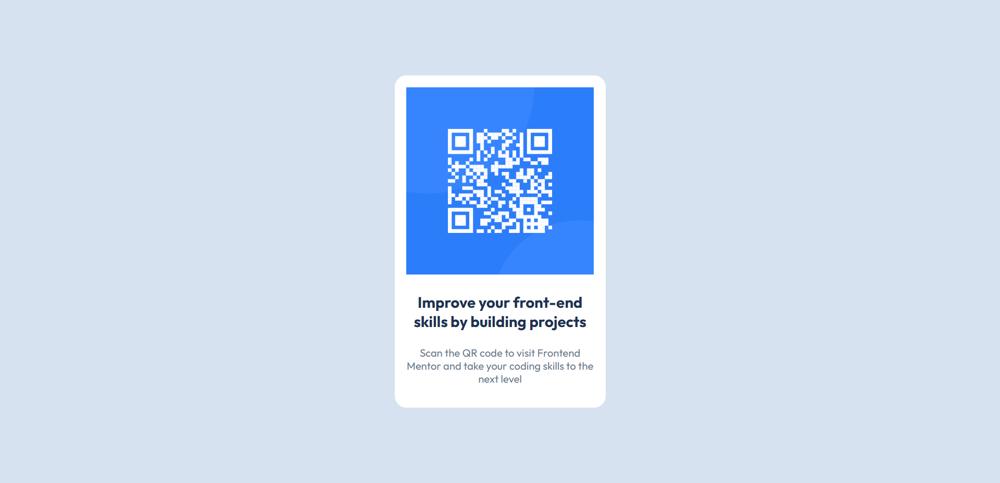

# Frontend Mentor - QR 碼元件解答

## 目錄

- [Overview](#overview)
  （概覽）
  - [Screenshot](#screenshot)
    （截圖）
  - [Links](#links)
    （連結）
- [My process](#my-process)
  （我的流程）
  - [Built with](#built-with)
    （使用技術）
  - [What I learned](#what-i-learned)
    （我所學到的）
  - [Continued development](#continued-development)
    （持續開發）
  - [Useful resources](#useful-resources)
    （實用資源）
- [Author](#author)
  （作者）


## 概覽

### 截圖



### 連結

- Solution URL: [Add solution URL here](https://your-solution-url.com)
  （解答網址：在此新增解答網址）
- Live Site URL: [Add live site URL here](https://your-live-site-url.com)
  （線上網站網址：在此新增線上網站網址）

## My process
## 我的流程

### Built with
### 使用技術

- Semantic HTML5 markup
  （語義化 HTML5 標記）
- CSS custom properties
  （CSS 自訂屬性）
- Flexbox
- CSS Grid
- Mobile-first workflow
  （行動優先工作流程）
- [React](https://reactjs.org/) - JS library
  （React - JS 函式庫）
- [Next.js](https://nextjs.org/) - React framework
  （Next.js - React 框架）
- [Styled Components](https://styled-components.com/) - For styles
  （Styled Components - 用於樣式）

**Note: These are just examples. Delete this note and replace the list above with your own choices**
**注意：以上只是範例。刪除此說明並用你自己的選擇取代上方清單。**

### What I learned
### 我所學到的

Use this section to recap over some of your major learnings while working through this project. Writing these out and providing code samples of areas you want to highlight is a great way to reinforce your own knowledge.
使用此部分回顧你在完成此專案過程中的主要學習心得。將這些內容寫下並提供你想強調的程式碼範例，是強化自身知識的好方法。

To see how you can add code snippets, see below:
若要了解如何新增程式碼片段，請見以下範例：

```html
<h1>Some HTML code I'm proud of</h1>
```
```css
.proud-of-this-css {
  color: papayawhip;
}
```
```js
const proudOfThisFunc = () => {
  console.log('🎉')
}
```

If you want more help with writing markdown, we'd recommend checking out [The Markdown Guide](https://www.markdownguide.org/) to learn more.
如果你需要更多 Markdown 寫作方面的協助，我們建議查看 [The Markdown Guide](https://www.markdownguide.org/) 以了解更多。

**Note: Delete this note and the content within this section and replace with your own learnings.**
**注意：刪除此說明及本節內容，並替換為你自己的學習心得。**

### Continued development
### 持續開發

Use this section to outline areas that you want to continue focusing on in future projects. These could be concepts you're still not completely comfortable with or techniques you found useful that you want to refine and perfect.
使用此部分概述你在未來專案中想持續專注的領域。這些可以是你尚未完全熟悉的概念，或是你覺得有用且想進一步精進的技術。

**Note: Delete this note and the content within this section and replace with your own plans for continued development.**
**注意：刪除此說明及本節內容，並替換為你自己的持續開發計畫。**

### Useful resources
### 實用資源

- [Example resource 1](https://www.example.com) - This helped me for XYZ reason. I really liked this pattern and will use it going forward.
  （範例資源 1 - 這以 XYZ 原因對我有所幫助。我非常喜歡這個模式，未來會繼續使用。）
- [Example resource 2](https://www.example.com) - This is an amazing article which helped me finally understand XYZ. I'd recommend it to anyone still learning this concept.
  （範例資源 2 - 這是一篇很棒的文章，幫助我終於理解了 XYZ。我會推薦給任何仍在學習這個概念的人。）

**Note: Delete this note and replace the list above with resources that helped you during the challenge. These could come in handy for anyone viewing your solution or for yourself when you look back on this project in the future.**
**注意：刪除此說明，並用在挑戰過程中對你有所幫助的資源替換上方清單。這些資源可能對任何查看你解答的人，或未來你回顧此專案時都有所幫助。**

## Author
## 作者

- Website - [Add your name here](https://www.your-site.com)
  （網站 - 在此新增你的名稱）
- Frontend Mentor - [@yourusername](https://www.frontendmentor.io/profile/yourusername)


